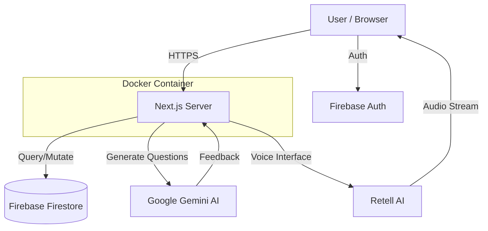

# 🏗️ Architecture

## Overview

AI Mock Interview Platform is a web application that conducts realistic job interviews using AI agents. Users can practice interviews, receive real-time feedback, and improve their skills through interactive sessions.

## Tech Stack

| Layer | Technology |
|-------|------------|
| **Frontend** | Next.js 15, React 19, TailwindCSS, Lucide Icons |
| **Backend** | Next.js Server Actions, API Routes |
| **AI Generation** | Google Gemini AI |
| **AI Voice** | Retell AI |
| **Database** | Firebase Firestore |
| **Auth** | Firebase Authentication |
| **Container** | Docker |
| **CI/CD** | GitHub Actions |

## System Flow

## Docker Strategy

### Why Docker?
1.  **Consistency**: Ensures the application runs the same way across development and production environments.
2.  **Portability**: Can be deployed easily to any cloud provider that supports containers (AWS ECS, Google Cloud Run, Vercel, etc.).
3.  **Isolation**: Separates application dependencies from the host system.

### Multi-Stage Build
We use a multi-stage `Dockerfile` to optimize image size:
1.  **Stage 1 (deps)**: Installs all dependencies (including devDependencies) to build the app.
2.  **Stage 2 (builder)**: Builds the Next.js application (creating `.next/standalone`).
3.  **Stage 3 (runner)**: A minimal Production image (Alpine Linux) that only contains the necessary artifacts to run the app.

## CI/CD Pipeline

The project uses GitHub Actions for Continuous Integration and Deployment:

1.  **Trigger**: Pushes to the `main` branch.
2.  **Build Job**:
    *   Checks out the code.
    *   Sets up Docker Buildx.
    *   Logs in to Docker Hub (using secrets).
    *   Builds the Docker image.
    *   Pushes the image to Docker Hub with `latest` and `sha` tags.
3.  **Deployment**: (Future Step) The updated image can be pulled and redeployed on the hosting server.

## Future Improvements
- [ ] Add Redis for rate limiting and caching.
- [ ] Implement Kubernetes manifests for scaling.
- [ ] Add monitoring with Prometheus/Grafana.
